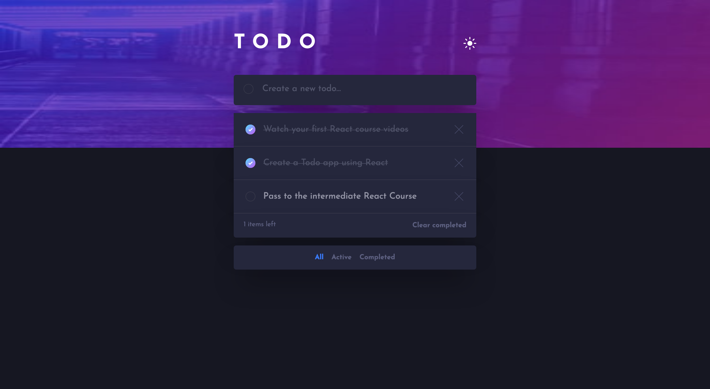
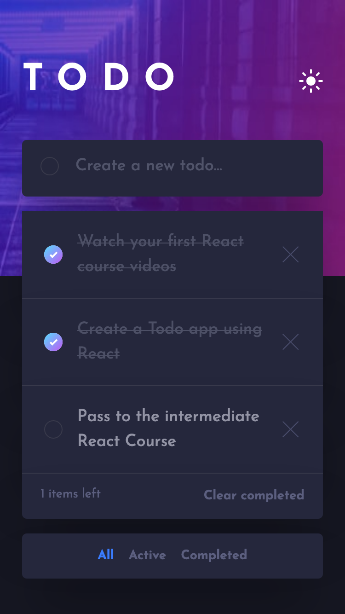
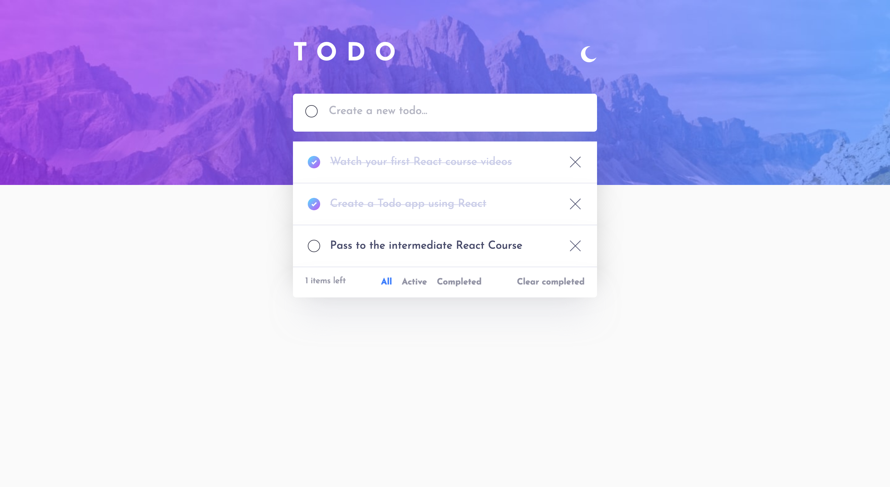
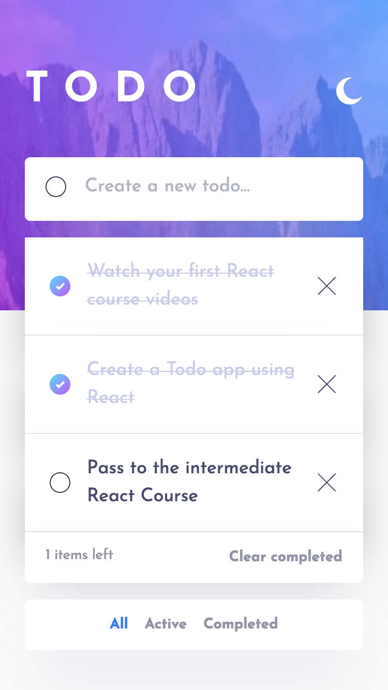

# Frontend Mentor - Todo app solution

This is a solution to the [Todo app challenge on Frontend Mentor](https://www.frontendmentor.io/challenges/todo-app-Su1_KokOW). Frontend Mentor challenges help you improve your coding skills by building realistic projects.

## Table of contents

- [Overview](#overview)
  - [The challenge](#the-challenge)
  - [Screenshot](#screenshot)
  - [Links](#links)
- [My process](#my-process)
  - [Built with](#built-with)
  - [What I learned](#what-i-learned)
  - [Continued development](#continued-development)
- [Author](#author)

## Overview

### The challenge

Users should be able to:

- View the optimal layout for the app depending on their device's screen size
- See hover states for all interactive elements on the page
- Add new todos to the list
- Mark todos as complete
- Delete todos from the list
- Filter by all/active/complete todos
- Clear all completed todos
- Toggle light and dark mode

### Screenshot

{: width="200px" height="300px"}
{: width="200px" height="300px"}
{: width="200px" height="300px"}
{: width="200px" height="300px"}

### Links

- [Solution URL](https://github.com/alex-castelo/fe-mentor-todo-app)
- Live Site URL: [Add live site URL here](https://your-live-site-url.com)

## My process

### Built with

- Semantic HTML5 markup
- Mobile-first workflow
- Pre-commit testing and linting
- [React Testing Library](https://testing-library.com)
- [React](https://reactjs.org/)
- [Vite](https://vitejs.dev/)

### What I learned

This is my first React project so all was new for me. I've learned several things:

- How to use `JSX`sintax
- How to use `useState` and `useEffect` hooks
- How React handles data flow

### Some code

I've really liked the what I've done here creating a hook to use local storage.

```js
import { useState, useEffect } from "react";

function getStorageValue(key, defaultValue) {
  const saved = localStorage.getItem(key);
  const initial = JSON.parse(saved);
  return initial || defaultValue;
}

export const useLocalStorage = (key, defaultValue) => {
  const [value, setValue] = useState(() => {
    return getStorageValue(key, defaultValue);
  });

  useEffect(() => {
    localStorage.setItem(key, JSON.stringify(value));
  }, [key, value]);

  return [value, setValue];
};
```

### Continued development

"If I had continued with this project, I could have implemented various enhancements:

- Making the to-dos editable
- Enabling drag-and-drop functionality to reorder the to-do list
- Adding some end-to-end tests (E2E)
- Developing the application into a full-stack solution."

## Author

- Frontend Mentor - [@alex-castelo](https://www.frontendmentor.io/profile/alex-castelo)
- Twitter - [@jove_nai](https://mobile.twitter.com/jove_nai)
